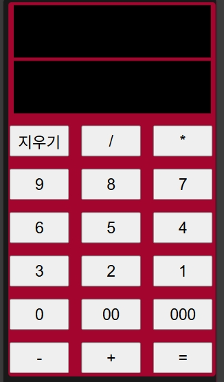

# Calculator
A simple calculator implemented in JavaScript.

## Main Features
- "+", "-", "*", "/" Performs arithmetic operations.
- Developed with mobile browsers in mind.

## Language Used
- HTML
- CSS
- JavaScript

## Screenshot

## How to install and run
- You can check **"index.html"** in the folder of the corresponding version.
- https://runamusedly.github.io/calculatorWithJavascript/calculatorVersion1.0/index.html

## LIcense
It uses the MIT license.
  

